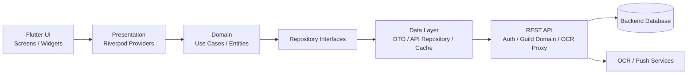
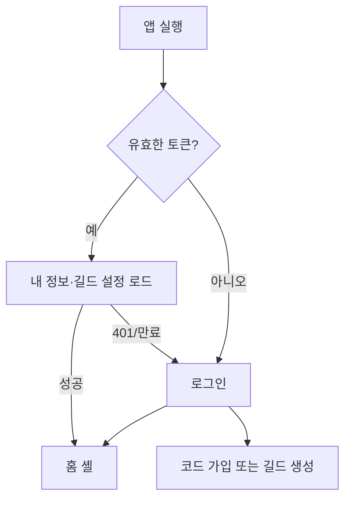

# Odin Guild App Flutter 프론트엔드 설계 문서

> 상태: 초안
> 
> 기준일: 2026-08-10
> 
> 기준 프로젝트: `odin_boss_schedule`

> UI 기본 기준: [`ui-design-guide.md`](ui-design-guide.md)

## 1. 문서 목적

기존 `odin_boss_schedule` 웹 애플리케이션의 기능을 Flutter 앱으로 이전하기 위한 프론트엔드 설계 초안이다. 백엔드와 프론트엔드는 별도 프로젝트로 운영하며, Flutter 앱은 REST API를 통해서만 데이터에 접근한다.

이 문서에서 정하는 범위는 다음과 같다.

- Flutter 앱의 전체 구조와 패키지 경계
- 인증 이후의 화면 및 라우팅 구성
- 기존 기능을 모바일 화면으로 재구성하는 방법
- 역할별 기능 노출과 백엔드 권한 검증 경계
- 현재 API를 연동하기 위한 저장소·DTO·상태 관리 기준
- 1차 구현 순서와 연동 전 백엔드 보완 항목

## 2. 기존 프로젝트 기준 기능 범위

현재 웹 프로젝트는 보스 일정 중심의 길드 운영 도구이며, 다음 기능을 포함한다.

| 영역 | 기존 기능 | Flutter 화면 방향 |
| --- | --- | --- |
| 인증 | 로그인, 가입 코드 회원가입·선택적 길드 생성, 자동 로그인, 로그아웃 | 인증 플로우로 분리 |
| 홈 | 길드명, 사용자 역할, 기능 메뉴, 테마 | 모바일 홈 대시보드 |
| 보스 일정 | 직접 입력, 기준 시간+간격 계산, 고정 일정, 스크린샷 OCR, 컷/멍, 참여 목록, 자동 동기화 | 일정 탭의 핵심 화면 |
| 보스 참여 투표 | 오늘·내일 투표, 참여/취소, 참여자 조회, 마감·삭제, 기간별 통계, 길드원별 참여율 | 투표 목록과 운영 통계 화면 |
| 공지 | 길드룰, 가격표, 보스 통제 상태 | 탭형 공지 화면 |
| 손지원 | 지원 요청, 신청, 지원자 선택, 완료·취소 | 요청 목록 + 상세 바텀시트 |
| 아이템 현황 | 컬렉션 V1/V2, 체크 상태, 우선순위 제외 | V2 기준 표/카드 화면 |
| 콘텐츠 참여 | 그룹 생성, 길드원 배치, 드래그 앤 드롭 | 그룹 보드 화면 |
| 공성전 | 시작 전·종료 후 다이아, 사용량, 운영진 일괄 수정 | 현황 요약 + 길드원 목록 |
| 길드원 관리 | 장비·스킬·전투력 조회, 역할 변경, 길드장 위임, 비밀번호 초기화, 강퇴 | 목록·상세·관리 화면 |
| 내 정보/설정 | 캐릭터, 부계정, 전투력, 길드·가입 코드 | 프로필과 운영 설정 |

### 2.1 역할 모델

백엔드의 역할 값은 현재 `MASTER`, `ADMIN`, `MEMBER`를 사용한다.

| 역할 | 표시명 | 기본 권한 |
| --- | --- | --- |
| `MASTER` | 길드장 | 전체 운영, 길드원 역할·삭제·위임, 컬렉션 전체 수정, 길드 설정의 마스터 항목 수정 |
| `ADMIN` | 운영진 | 일정·투표·공지·컬렉션·그룹·공성전 등 운영 기능 관리 |
| `MEMBER` | 길드원 | 일정 조회·등록·컷·멍·개별 삭제, 투표 참여, 본인 정보·본인 상태 수정, 공개 현황 조회 |

화면에서 버튼을 숨기는 것은 UX 처리일 뿐 보안 경계가 아니다. 모든 생성·수정·삭제·역할 변경은 백엔드에서 다시 권한을 검사해야 한다.

### 2.2 기존 스레드에서 이어받은 결정

- 보스 투표 이력은 현재 일정 테이블과 분리된 immutable event history로 보존한다.
- 투표의 `참여마감`과 `삭제`는 서로 다른 동작으로 취급한다. 마감은 참여자를 보존하고, 삭제는 참여자·이력을 제거한다.
- 보스 참여 이력의 기본 보존 기간은 출현 시각 기준 90일이다.
- 컬렉션은 이름 기반 V1보다 고정 `collectionItemId` 기반 V2를 우선 사용한다.
- OCR 결과는 자동 저장하지 않고, 사용자가 보스명과 시각을 확인한 뒤 일정으로 등록한다.

## 3. 아키텍처 방향

### 3.1 책임 분리



Flutter가 담당하는 영역과 백엔드가 담당하는 영역을 다음처럼 나눈다.

| 책임 | Flutter | 백엔드 |
| --- | --- | --- |
| 화면 표시·입력 검증 | 담당 | 최종 검증도 담당 |
| JWT 저장·전송 | 담당. Secure Storage 사용 | 발급·만료·검증 |
| 역할별 화면 노출 | 담당 | 실제 권한 검증 |
| 보스 젠 시간 계산 | 표시용 카운트다운만 담당 | 기준 시간, 쿨타임, 다음 젠 계산 |
| 투표 결과 | 결과 표시·상태 갱신 | 저장·중복 방지·일관성 보장 |
| OCR | 이미지 선택·미리보기·업로드 | OCR 비밀키 보관·외부 OCR 호출 |
| 알림 | FCM 토큰 수명주기·포그라운드 로컬 표시·탭 라우팅·음성 | 보스 알림 예약·FCM 발송·발송 이력 중복 방지 |
| DB/파일 | 접근하지 않음 | SQLite 또는 별도 DB 관리 |

### 3.2 추천 Flutter 기술 구성

필수 기술을 최소화하되 기능별 책임이 분명하도록 구성한다.

| 목적 | 추천 패키지/방식 |
| --- | --- |
| 상태 관리 | `flutter_riverpod` |
| 라우팅 | `go_router` |
| HTTP | `dio` + 공통 interceptor |
| JSON 모델 | `json_serializable` 또는 `freezed` |
| 토큰 보관 | `flutter_secure_storage` |
| 화면 설정 | `shared_preferences` |
| 날짜/시간 | `intl`, Asia/Seoul 기준 포맷터 |
| 이미지 선택 | `image_picker` 또는 `file_picker` |
| 로컬 알림 | `flutter_local_notifications` |
| 원격 알림 | `firebase_core` + `firebase_messaging` (현재 Android만 지원) |
| 음성 알림 | `flutter_tts`를 선택 기능으로 적용 |
| 드래그 앤 드롭 | Flutter 기본 `Draggable`/`DragTarget` 또는 검증된 reorder 패키지 |

패키지는 처음부터 모두 추가하지 않고 각 기능을 구현할 때 도입한다. 특히 백그라운드 알림은 Android/iOS 정책 차이가 크므로 1차 버전에서는 포그라운드 알림을 우선 지원한다.

### 3.3 프로젝트 폴더 구조

기능별로 화면·상태·도메인·API를 함께 묶는 feature-first 구조를 사용한다.

```text
lib/
├── main.dart
├── app/
│   ├── app.dart
│   ├── router.dart
│   ├── theme.dart
│   └── app_bootstrap.dart
├── core/
│   ├── config/
│   │   ├── env.dart
│   │   └── api_paths.dart
│   ├── network/
│   │   ├── api_client.dart
│   │   ├── api_exception.dart
│   │   └── auth_interceptor.dart
│   ├── storage/
│   │   ├── secure_token_storage.dart
│   │   └── preference_storage.dart
│   ├── time/
│   │   ├── server_clock.dart
│   │   └── seoul_datetime.dart
│   ├── permissions/
│   │   └── role_guard.dart
│   ├── widgets/
│   │   ├── async_state_view.dart
│   │   ├── error_view.dart
│   │   ├── empty_view.dart
│   │   └── confirm_dialog.dart
│   └── utils/
├── features/
│   ├── auth/
│   │   ├── data/
│   │   ├── domain/
│   │   └── presentation/
│   ├── home/
│   ├── schedule/
│   ├── boss_vote/
│   ├── notices/
│   ├── support/
│   ├── collections/
│   ├── content_groups/
│   ├── siege/
│   ├── members/
│   ├── profile/
│   └── settings/
└── shared/
    ├── models/
    ├── role_labels.dart
    └── formatters.dart
```

각 feature의 권장 내부 구조는 다음과 같다.

```text
features/schedule/
├── data/
│   ├── schedule_api.dart
│   ├── schedule_dto.dart
│   └── schedule_repository_impl.dart
├── domain/
│   ├── boss_schedule.dart
│   ├── schedule_repository.dart
│   └── schedule_use_cases.dart
└── presentation/
    ├── schedule_screen.dart
    ├── schedule_controller.dart
    ├── schedule_state.dart
    └── widgets/
```

화면에서 `Dio`를 직접 호출하지 않는다. 화면은 controller/provider를 호출하고, controller는 use case 또는 repository를 통해 API를 사용한다.

## 4. 앱 셸과 라우팅

### 4.1 인증 전후 구조



앱 시작 시 다음 순서로 bootstrap한다.

1. Secure Storage에서 access token을 읽는다.
2. 토큰이 있으면 `/api/users/me`를 호출한다.
3. 필요하면 `/api/settings`를 호출해 길드명과 정책을 가져온다.
4. 실패가 401이면 토큰을 지우고 로그인 화면으로 이동한다.
5. 그 외 오류는 재시도 가능한 bootstrap 오류 화면을 표시한다.

현재 로그인 토큰의 유효기간은 서버 기준 7일이다. refresh token API가 없으므로 만료 시 재로그인시키고, 추후 별도 refresh API를 추가한다.

### 4.2 화면 라우트

| Route | 화면 | 설명 |
| --- | --- | --- |
| `/login` | 로그인 | 아이디·비밀번호, 아이디 저장, 자동 로그인 |
| `/register` | 회원가입 | 기존 길드 가입 또는 새 길드 생성(마스터)과 계정·캐릭터 등록 |
| `/home` | 홈 대시보드 | 길드 정보와 기능 카드 |
| `/schedule` | 보스 일정 | 일정 조회·입력·참여·운영 |
| `/schedule/ocr` | 일정 OCR | 스크린샷 선택·분석·결과 검토 |
| `/boss-vote` | 보스 참여 투표 | 투표 목록과 참여자 |
| `/boss-vote/stats` | 참여 통계 | 날짜·월별 통계와 길드원 참여율 |
| `/notices` | 공지 | 길드룰·가격표·보스 통제 |
| `/support` | 손지원 매칭 | 요청·신청·매칭 |
| `/collections` | 아이템 현황 | V2 컬렉션 체크 |
| `/content-groups` | 콘텐츠 참여 | 그룹 편성 |
| `/siege` | 공성전 현황 | 다이아 현황 |
| `/members` | 길드원 명단 | 전투력·장비·스킬 조회 및 관리 |
| `/profile` | 내 정보 설정 | 계정·캐릭터·부계정·장비·스킬 전체 편집 |
| `/settings` | 마스터 설정 | 길드장 전용 길드 정책·가입 코드 |

### 4.3 모바일 내비게이션

하단 내비게이션은 다음 4개로 단순화한다.

- 홈: 길드 공지 요약과 자주 쓰는 메뉴
- 일정: 보스 스케줄
- 투표: 보스 참여 투표
- 더보기: 공지, 손지원, 컬렉션, 콘텐츠, 공성전, 길드원, 프로필, 설정

웹의 메뉴 카드 전체를 홈에 그대로 나열하지 않고, 모바일에서는 핵심 기능을 우선 노출한다. 운영진에게만 관리 버튼과 설정 진입점을 추가로 보여준다.

## 5. 화면 및 기능 구성

### 5.1 로그인·가입

#### 로그인 화면

- 아이디, 비밀번호 입력
- 아이디 저장: 아이디만 `shared_preferences`에 저장
- 자동 로그인: 토큰을 Secure Storage에 유지
- 로그인 성공 시 역할·닉네임은 `/api/users/me` 응답을 기준으로 갱신
- 401, 네트워크 단절, 서버 오류를 구분해 메시지 표시
- 비밀번호는 로그·분석 이벤트에 남기지 않음

#### 회원가입 화면

- 로그인 화면에서 회원가입으로 진입할 수 있으며, `기존 길드 가입`과 `새 길드 생성`을 선택한다.
- 기존 길드 가입은 마스터가 발행한 가입 코드 입력이 필수다.
- 새 길드 생성은 길드 이름을 입력하고 가입 코드는 입력하지 않는다. 서버가 계정을 `MASTER`로 만들고 새 길드를 함께 생성한다.
- 가입 코드와 길드 이름의 유효성·중복 여부는 가입 API가 최종 판단
- 계정 정보: 아이디·비밀번호
- 캐릭터 정보: 닉네임, 직업, 주클래스, 전투력
- 장비 13부위의 이름·등급
- 액티브/패시브 스킬 강화 상태
- 가입 코드는 만료 없이 유지되며, 마스터가 변경하기 전까지 여러 사용자가 계속 사용할 수 있다.
- 가입 성공 후 로그인 화면으로 이동

### 5.2 홈 대시보드

- 상단: 길드명, 내 닉네임, 역할, 로그아웃
- 오늘의 요약: 다음 보스, 오늘 투표 수, 열린 손지원 요청 수
- 빠른 실행: 보스 일정, 투표, 공지
- 운영진 빠른 실행: 일정 입력, 공지 편집, 가입 코드 관리, 설정
- 테마: `Icon Purple`/`Sand Gold`/`Dark Blue`를 앱 ThemeMode로 매핑하고 선택값을 저장
- 앱이 백그라운드에서 돌아온 경우 요약 데이터를 다시 조회

홈의 요약 수치는 별도 대시보드 API가 없으면 여러 API를 조합해 계산한다. 호출이 많아지면 백엔드에 `/api/dashboard`를 추가한다.

### 5.3 보스 일정 화면

#### 조회 영역

- 현재 서버 시간과 마지막 동기화 시각
- 보스 유형 필터: 공통, 본섭, 침공, 고정
- 일반 보기/간략히 보기 전환
- 일정 카드: 유형, 지역, 보스명, 출현 시각, 남은 시간, 멍 표시
- 지난 보스와 다음 보스 강조
- 30초 주기 동기화. 앱이 백그라운드에 있을 때 polling을 중지하고 복귀 시 즉시 새로고침
- 일정 간 30분 이상 공백은 휴식 시간으로 표시

#### 일정 입력

- 모든 활성 길드원이 사용하는 입력 전용 페이지
- 직접 입력 탭
  - 지역/챕터별 아코디언
  - 기준 시간 입력
  - 보스별 간격 입력: `2410`, `10분 20초` 등 기존 입력 형식 지원
  - 챕터만 적용, 전체 적용
  - Enter 입력 시 해당 챕터 적용
- 고정 일정
  - 보스명, 지역, 시각, 요일, 색상
- 보스 관리
  - 보스 추가·삭제
  - 쿨타임·지역·유형 설정
  - 보스 표시 순서 변경
  - 기본 보스 초기화
- 참여 보스 설정
  - 본섭·침공 유형을 구분해 참여 버튼을 노출할 보스 선택
  - 보스명 대신 `bossDefinitionId`로 저장해 같은 이름의 서로 다른 유형·지역 보스를 독립 설정

#### 일정 액션

- 모든 활성 길드원은 일정 등록·컷·멍·개별 삭제를 수행할 수 있다.
- 컷: 쿨타임 기준 다음 젠 생성
- 멍: 현재 젠 시각을 기준으로 다음 젠 생성하고 `is_mung` 표시
- 삭제: 고정 이벤트는 삭제하지 않음
- 참여: 본인 참여 토글, 참여 중이면 참여자 목록 조회
- 전체 초기화: MASTER/ADMIN만 노출하고 확인 다이얼로그 필수

#### OCR 일정 등록

- 기기에서 이미지 선택
- 파일명·용량·미리보기 표시
- 이미지 크기 최적화 후 `/api/ocr/boss-schedule` 업로드
- OCR 템플릿 선택
- 인식 결과를 바로 저장하지 않고 보스명·시각을 검토하는 단계 제공
- 분석 실패·지원하지 않는 이미지·5MB 초과를 구분
- OCR 비밀키와 템플릿 호출 정보는 Flutter에 포함하지 않음

#### 알림

- 서버 시각과 로컬 시각의 offset을 계산해 카운트다운 오차를 줄임
- 포그라운드에서 출현 5분 전·1분 전·출현 시점 알림
- 음성 알림 on/off와 테스트 버튼
- Android 백그라운드/강제 종료 알림은 FCM notification+data 메시지로 수신
- Android 백그라운드/강제 종료 상태에서도 FCM 백그라운드 handler가 음성 설정을 확인한 뒤 보스 알림 문장을 TTS로 재생
- iOS 포그라운드 음성은 `AVAudioSession`을 재생·음성 안내 모드로 설정한 뒤 `flutter_tts`로 재생
- iOS 백그라운드에서 동적인 보스 문장을 TTS로 재생하는 것은 현재 지원 범위에 포함하지 않으며, iOS FCM/APNs 알림음은 별도 인증·백그라운드 정책 검토가 필요함
- 포그라운드 FCM은 `flutter_local_notifications`로 표시하고 알림 탭 시 일정 화면으로 이동
- 로컬 일정 알림과 FCM은 보스 정의 ID·출현 시각·리드타임 occurrence 및 `notificationKey`로 중복 방지

### 5.4 보스 참여 투표

#### 목록

- 오늘·내일·지난 일정 필터
- 보스명, 유형, 지역, 축 보스 표시
- 참여/참여 취소 토글
- 참여자 수와 참여자 목록 바텀시트
- `ACTIVE`, `INACTIVE`, `DELETED` 상태에 따른 버튼 표시

#### 운영진 기능

- 수동 투표 보스 추가: 보스명, 시각, 유형, 지역, 축 여부
- 수동 투표 추가 요청은 `POST /api/vote-bosses/manual`에
  `{boss, spawnTime, type, region, isBlessed}`를 전송하며, `spawnTime`은 서울 기준
  epoch milliseconds다.
- 참여 마감: 참여자는 유지하고 추가 참여만 차단
- 투표 항목 삭제: 투표 참여자·이력을 삭제하는 destructive action
- 참여 통계에서 특정 참여자 제거
- 날짜별·월별 통계
- 기간 내 길드원별 참여 횟수·미참여 횟수·참여율

#### 저장 정책 표시

- 기존 서버는 보스 출현 시각 기준 기본 90일간 투표 이력을 보존
- 오래된 일정·참여·투표 상태는 서버 정리 정책에 따라 삭제될 수 있음
- 앱은 보존 기간을 임의로 계산하지 않고 API가 반환한 범위만 표시

### 5.5 공지 화면

상단 탭 3개로 구성한다.

1. 길드룰: 카드 목록, 상세 본문, 운영진의 등록·수정·삭제·순서 변경
2. 가격표: 가격 가이드 카드와 가격 항목, 운영진 CRUD
3. 보스 통제: 챕터별 보스 상태를 `NONE` → `ALLY_ONLY` → `CONTROL` 순환

일반 길드원은 읽기 전용이다. 긴 규칙 본문은 카드 접기/펼치기를 제공하고, 색상은 서버에서 내려온 값을 안전하게 제한한다.

- 화면 상단에 `/api/users`의 MASTER·ADMIN을 현재 운영진으로 요약한다.
- MASTER·ADMIN은 app bar에서 길드룰과 가격표를 등록하고 카드 overflow 메뉴에서 수정·삭제한다.
- 길드룰 순서는 `/api/notices/rule-order`에 전체 ID 배열을 저장하며 실패하면 낙관적 변경을 되돌린다.
- 길드룰 편집은 상단 안내, 제목·본문 섹션, 마무리 문구를 기존 구조화 문자열 형식으로 변환한다.
- 가격표 편집은 섹션과 아이템·가격 행을 기존 구조화 문자열 형식으로 변환한다.
- 보스 통제는 한 보스 단위로 `PUT /api/notices/boss-controls`를 호출하고 성공 후 전체 공지 상태를 다시 조회한다.
- MEMBER에게는 등록 버튼, 카드 관리 메뉴, 통제 변경 동작을 노출하지 않는다. 서버도 동일 권한을 검증한다.

### 5.6 손지원 매칭

- 요청 등록: 날짜, 종일 여부 또는 시작·종료 시각, 메모
- 요청 목록: OPEN, MATCHED, DONE, CANCELED 상태 표시
- 다른 길드원의 OPEN 요청에 지원 신청, 본인 신청 취소
- 요청자 또는 운영진이 지원자 선택
- 요청자 또는 운영진이 완료·취소·재모집 처리
- 요청자 또는 운영진이 삭제
- 본인 요청에는 지원 신청 버튼을 표시하지 않음
- 신청/선택/상태 변경 후 목록을 다시 조회해 동시 변경을 반영
- 서버의 requester·application 응답을 `SupportRequest`와 `SupportApplication`으로 분리하고 status 문자열을 enum으로 정규화한다.
- 화면은 `진행중/내 활동/종료` 필터를 제공하고 서버가 정렬한 OPEN → MATCHED → 종료 순서를 유지한다.
- 손지원 UI에서는 직업을 생략하고 요청자·지원자의 주클래스와 전투력만 독립된 label·value로 강조한다. API 호환을 위해 occupation 필드는 모델에 유지한다.
- 지원자는 선택 상태를 우선한 뒤 전투력 내림차순으로 비교한다. 카드에는 최대 3명만 표시하고 전체 목록은 지연 생성 bottom sheet에서 조회한다.
- 요청 등록 문자열은 기존 서버와 호환되도록 `yyyy-MM-dd 종일` 또는 `yyyy-MM-dd HH:mm~HH:mm` 형식으로 전송한다.
- 메모 500자와 요청 시간 80자 제한을 클라이언트에서 먼저 검증하고 서버 검증을 최종 기준으로 사용한다.
- 요청자 여부는 세션의 userId로 판단하고, 운영진의 전체 관리 권한은 `RoleGuard.canManageSupport`에서 MASTER·ADMIN으로 제한한다.
- 접속 계정과 비밀번호는 API 데이터에 포함하지 않고 개인 연락으로만 공유하도록 안내한다.

### 5.7 아이템 현황

Flutter 1차 구현은 기존 V1이 아닌 안정적인 V2 API를 사용한다.

- 컬렉션·아이템 목록 조회
- 검색: 컬렉션명·부위
- 컬렉션 필터
- 내 상태만 보기
- 길드원별 완료 체크 상태
- 본인 상태 토글
- MASTER의 전체 길드원 수정
- 운영진/길드원의 권한 범위는 백엔드 정책에 맞춰 조정
- 컬렉션 추가·수정·삭제
- 아이템 표시 순서 변경
- 아이템 분배 우선순위 제외 길드원 관리

체크 상태의 키는 컬렉션명 문자열이 아니라 `collectionItemId`를 사용한다. 컬렉션 이름이나 아이템명이 변경되어도 기존 상태가 다른 아이템으로 이동하지 않게 한다.

- Flutter 화면은 개인 현황을 기본 탭으로 사용하고 길드 비교를 별도 탭으로 분리한다.
- 길드 비교는 `아이템 기준`을 기본으로 제공한다. 아이템 카드에는 보유율·미보유 인원·분배 1순위만 유지하고 전체 길드원 상태는 별도 상세 sheet에서 조회한다.
- 아이템 상세 sheet는 전투력 내림차순 목록, 닉네임 검색, 전체·미보유·보유 필터를 제공하고 보이는 행만 생성해 50명 이상에서도 카드 높이와 렌더링 비용이 증가하지 않게 한다.
- `길드원 기준`에서는 길드원별 전체·컬렉션 달성률과 전투력을 비교한다.
- `/api/v2/collections`, `/api/users`, `/api/v2/user-collections`, `/api/excluded-members`를 병렬 조회해 하나의 overview로 구성한다.
- 길드원은 누구나 다른 길드원의 현황을 조회할 수 있지만 체크 변경은 본인만 가능하다.
- MASTER는 모든 길드원의 체크를 변경할 수 있고 MASTER·ADMIN은 컬렉션 CRUD와 우선순위 제외를 관리한다.
- 체크와 제외 상태는 낙관적으로 반영하고 API 실패 시 이전 상태로 복구한다.
- MASTER와 로그인 아이디가 `움매`인 활성 회원은 `GET /api/v1/collection-completion-logs`에서 체크 변경자·대상 회원·item·변경 상태·시각을 최신순으로 조회한다.
- 체크 변경 로그는 `limit`(기본 30, 최대 100)과 `cursor`를 사용하는 cursor 페이지네이션으로 추가 로드한다.
- 특정 길드원의 체크 변경 이력은 `targetUserId` query parameter로 필터링한다.
- 분배 1순위는 전투력 내림차순 길드원 중 미달성·비제외 사용자를 먼저 선택하고, 모두 제외된 경우에만 제외 사용자를 후순위로 선택한다.
- 컬렉션 수정 요청에 기존 item ID와 화면 순서를 함께 전달해 이름·강화 수정 후에도 체크 상태가 유지되게 한다.

### 5.8 콘텐츠 참여 그룹

- 길드원 목록과 그룹 보드의 2열 또는 `그룹/미편성` 탭형 레이아웃
- 운영진: 그룹 생성·이름 변경·삭제
- 운영진: 길드원 드래그 앤 드롭 배치·제거
- 일반 길드원: 현재 편성 읽기 전용
- 저장은 그룹 전체 멤버 ID를 한 번에 서버에 전송
- 드래그 중 네트워크 요청을 보내지 않고 드롭 완료 시 저장
- 저장 실패 시 이전 배치로 되돌리고 재시도 제공
- 모바일 그룹 카드는 최대 4명만 미리 표시하고 전체 명단은 지연 생성 상세 sheet에서 조회해 50명 이상에서도 카드 높이를 제한한다.
- 그룹 이동은 영향을 받는 원본·대상 그룹만 저장하고 일부 저장 실패 시 이전 멤버 ID 목록으로 보상 요청한 뒤 로컬 상태를 복구한다.
- legacy API 응답의 `memberIds` 배열 또는 쉼표 문자열을 repository에서 `List<int>`로 정규화한다.

화면 폭이 좁은 기기에서는 `그룹`과 `미편성`을 탭으로 나누고, 태블릿에서는 미편성 길드원과 그룹을 좌우 패널로 함께 표시한다.

### 5.9 공성전 현황

- 본인 입력: 공성 시작 전 다이아, 종료 후 잔여 다이아
- 본인 사용량은 `시작 전 - 종료 후`로 계산
- 전체 시작 전 합계, 종료 후 합계, 사용량 합계 요약
- 운영진은 길드원별 값 수정
- 운영진은 전체 초기화
- 숫자 입력은 음수·비정상적으로 큰 값·종료 후가 시작 전보다 큰 경우를 검증
- 마지막 수정 시각 표시
- API 응답의 `current_diamonds`, `remaining_diamonds`, `updated_at`은 repository에서 camelCase 도메인 모델로 변환한다.
- 목록은 전투력 내림차순을 보장하고 `CustomScrollView`의 지연 생성 sliver로 50명 이상을 처리한다.
- 본인 저장은 `/api/siege/me`, 운영진 수정은 `/api/admin/siege/:id`, 전체 초기화는 `/api/siege/all`을 사용하며 성공 후 전체 현황을 다시 조회한다.

### 5.10 길드원 관리

- 전투력, 치명타 확률, 치명타 저항, 상태/충격 적중 정렬
- 닉네임, 직업, 주클래스, 부계정 캐릭터명·클래스 검색
- 캐릭터 비교: 직업·주클래스 필터와 부계정·능력치 카드
- 장비 비교: 13부위 선택, 장비 등급·미입력 필터, 선택 부위의 길드원별 값 표시
- 스킬 비교: 액티브/패시브, 영웅·전설 스킬 선택, 습득·미습득 필터와 강화 수치 표시
- 길드원 상세: 직업, 주클래스, 부계정, 장비 13부위, 액티브/패시브 스킬
- MASTER의 MEMBER/ADMIN 역할 변경
- MASTER의 길드장 위임: 대상 MEMBER/ADMIN을 선택하면 기존 MASTER는 MEMBER가 되고 대상자가 MASTER가 된다.
- MASTER/ADMIN의 비밀번호 초기화
- MASTER의 길드원 강퇴
- 삭제 전 영향 범위와 영구 삭제 여부를 명시
- 목록 조회 결과를 캐시하되 프로필 변경 후에는 무효화
- `equipment`와 `skills` JSON 문자열은 repository에서 구조화된 모델로 변환하며 잘못된 개별 JSON은 빈 상태로 처리
- 모바일은 사람별 카드와 상세 화면, 760px 이상은 2열 카드 목록을 사용

### 5.11 내 정보 및 길드 설정

#### 내 정보

- 아이디 읽기 전용
- 비밀번호 선택 변경
- 닉네임, 직업, 주클래스, 전투력
- 최고 치명타 확률·저항·상적/충적
- 장비 13부위별 등급(`none`, `hero`, `legend`, `mythic`)과 이름·강화 수치
- 액티브/패시브 각각 영웅 4개·전설 2개의 강화 상태(`X`, `0강`~`10강`)
- 부계정 최대 1개, 캐릭터명 30자 제한, 캐릭터명·주클래스 쌍 검증
- 길드 설정에서 전투력 수정이 잠겨 있으면 입력도 잠그고 서버 응답을 기준으로 안내
- `equipment`와 `skills`가 JSON 문자열 또는 객체로 오는 기존 응답을 data layer에서 모두 정규화
- 능력치는 소수점을 보존하고 전투력은 화면에서만 천 단위 구분 기호를 적용
- 수정 성공 후 `/api/users/me`를 다시 조회해 세션의 닉네임·역할과 화면 요약을 갱신

#### 길드 설정

- Flutter 앱에서는 MASTER만 메뉴와 화면에 접근
- 길드명
- 길드원의 전투력 수정 허용 여부
- MEMBER/ADMIN 고정 가입 코드 조회·생성·변경 및 복사
- 처음 저장할 때 커스텀 코드를 비워두면 서버가 랜덤 코드를 생성하고, 입력하면 마스터 지정 코드로 저장
- 가입 코드는 변경 전까지 만료되지 않으며, 변경 시 이전 코드는 즉시 폐기
- Discord 설정은 앱 범위에서 제외하며 화면과 공개 모델에 노출하지 않음
- 기존 settings API가 전체 컬럼 저장만 지원하므로 앱 저장소는 조회한 Discord 값을 내부적으로 그대로 전달해 기존 서버 설정이 지워지지 않게 함

## 6. API 연동 설계

### 6.1 기본 규칙

- 개발/스테이징/운영 URL은 `--dart-define=API_BASE_URL=...`로 주입
- 모든 인증 API는 `Authorization: Bearer <accessToken>` 사용
- 401은 공통 interceptor가 토큰 삭제 후 로그인으로 이동
- 403은 권한 부족 화면 또는 안내 snackbar로 처리
- 네트워크 오류·타임아웃·서버 오류·유효성 오류를 서로 다른 `ApiException`으로 매핑
- 서버 응답 DTO와 앱 도메인 모델을 분리
- 현재 API의 `spawnTime`, `user_id`, `created_at`처럼 표기가 섞인 필드는 data layer에서 변환
- 성공 후 전체 조회가 필요한 기능과 로컬 상태만 갱신할 수 있는 기능을 명확히 구분

### 6.2 현재 API와 feature 매핑

| Feature | 주요 API |
| --- | --- |
| 인증 | `POST /api/v1/auth/login`, `POST /api/v1/auth/register`, `GET/PUT/DELETE /api/users/me` |
| 사용자 | `GET /api/users`, `PUT /api/admin/users/:id/role`, `PUT /api/admin/guild/master`, `PUT /api/admin/users/:id/reset-password`, `DELETE /api/admin/users/:id` |
| 공통 | `GET /api/time`, `GET/POST /api/settings`, `GET/POST /api/invites` |
| 보스 정의 | `GET /api/custom-bosses`, `POST /api/custom-bosses`, `POST /api/custom-bosses/reorder`, `DELETE /api/custom-bosses/:id` |
| 보스 일정 | `GET/POST /api/schedules`, `DELETE /api/schedules/:id`, `DELETE /api/schedules-all`, `POST /api/schedules/cut`, `POST /api/schedules/mung` |
| OCR | `GET /api/ocr/templates`, `POST /api/ocr/boss-schedule` |
| 일정 참여 | `GET/PUT /api/v1/participation-targets` (`bossDefinitionIds`), `GET /api/participants`, `GET /api/participation-states`, `POST /api/participants/:boss` |
| 보스 투표 | `GET /api/vote-bosses`, `POST /api/vote-bosses/manual`, `POST/DELETE /api/vote-bosses/:voteKey`, `DELETE /api/vote-bosses/:voteKey/permanent` |
| 투표 통계 | `GET /api/vote-stats`, `GET /api/vote-member-rates`, `POST /api/vote-participants/:voteKey`, `DELETE /api/vote-participants/:voteKey/users/:userId` |
| 공지 | `/api/notices/rules`, `/api/notices/price-guides`, `/api/notices/prices`, `/api/notices/boss-controls` |
| 손지원 | `/api/support-requests`, `/api/support-requests/:id/status`, `/api/support-requests/:id/applications`, `/api/support-requests/:requestId/applications/:applicationId`, `/api/support-requests/:requestId/select/:applicationId` |
| 컬렉션 | `/api/v2/collections`, `/api/v2/user-collections`, `/api/excluded-members` |
| 그룹 | `/api/groups`, `/api/groups/:id/members` |
| 공성전 | `/api/siege`, `/api/siege/me`, `/api/admin/siege/:id`, `/api/siege/all` |
| 푸시 알림 | `PUT/DELETE /api/v1/push-tokens` |

고정 가입 코드 계약은 다음을 기준으로 한다.

- `GET /api/invites` 응답: `{invites: [{inviteCode, role}]}`; 아직 생성하지 않은 역할은 목록에서 생략할 수 있다.
- `POST /api/invites` 요청: `targetRole`과 선택 값 `customCode`
- 처음 저장할 때 `customCode`가 비어 있으면 서버가 충돌하지 않는 랜덤 고정 코드를 생성한다.
- `POST /api/invites`는 역할별 고정 코드를 생성하거나 변경하며, 응답은 `inviteCode`, `role`이다.
- 코드는 만료되지 않고 여러 번 사용할 수 있으며, 변경 성공 시 이전 코드는 즉시 가입에 사용할 수 없다.
- `POST /api/v1/auth/register` 요청은 `mode`를 사용한다.
- `mode=JOIN_GUILD`이면 `code`가 필요하고 가입 API가 코드에 연결된 역할을 결정한다.
- `mode=CREATE_GUILD`이면 `guild_name`이 필요하며 서버가 새 길드와 `MASTER` 계정을 transaction으로 생성한다.
- `PUT /api/admin/guild/master` 요청은 `{target_user_id}`를 사용한다.
- 길드장 위임은 현재 `MASTER`만 실행할 수 있고, 같은 길드의 `MEMBER`/`ADMIN` 대상만 허용한다.
- 위임은 기존 `MASTER`를 `MEMBER`로 내리고 대상자를 `MASTER`로 올리는 단일 transaction이어야 하며, 성공 응답은 204 또는 빈 200을 사용한다.

현재 API를 그대로 사용할 경우 `ApiPaths`에 경로를 한 곳에서 관리한다. 백엔드가 준비되면 `/api/v1` 버전 경로로 이전하되, 화면·도메인 계층은 변경하지 않도록 repository만 교체한다.

### 6.3 Android FCM 기기 토큰 계약

- 모든 요청은 `Authorization: Bearer <accessToken>`을 사용한다.
- 앱이 로그인 세션을 복원하거나 로그인에 성공하고 알림 권한을 얻은 뒤 FCM 토큰을 조회해 아래 등록 API를 호출한다.
- Firebase의 `onTokenRefresh`가 새 토큰을 전달할 때 같은 API를 다시 호출한다. 서버는 `deviceId` 기준 이전 토큰을 교체한다.
- 로그아웃하기 전에 현재 토큰으로 삭제 API를 호출한다. 네트워크 실패로 삭제하지 못해도 다음 계정이 등록하면 동일 토큰의 소유권은 새 계정으로 이전된다.
- `deviceId`는 앱 설치 단위로 생성해 secure storage에 보존하는 임의 UUID이며 Android 하드웨어 식별자를 사용하지 않는다.

등록·갱신:

```http
PUT /api/v1/push-tokens
Authorization: Bearer <accessToken>
Content-Type: application/json

{
  "token": "<FCM registration token>",
  "platform": "ANDROID",
  "deviceId": "<installation UUID>"
}
```

```json
{
  "data": {
    "id": 12,
    "platform": "ANDROID",
    "deviceId": "<installation UUID>",
    "updatedAt": 1787461200000
  }
}
```

삭제:

```http
DELETE /api/v1/push-tokens
Authorization: Bearer <accessToken>
Content-Type: application/json

{ "token": "<FCM registration token>" }
```

성공 응답은 `204 No Content`이다. 삭제는 멱등적으로 처리되어 이미 없는 본인 토큰도 204를 반환한다. 토큰은 20~4096자, `deviceId`는 1~200자이며 iOS는 현재 계약 범위에 포함하지 않는다.

보스 알림의 notification title/body와 함께 다음 string data payload가 전달된다.

```json
{
  "type": "BOSS_SCHEDULE",
  "notificationKey": "boss:1:7:1787461500000:300",
  "guildId": "1",
  "scheduleId": "42",
  "bossDefinitionId": "7",
  "bossType": "필드",
  "region": "미드가르드",
  "boss": "파르바",
  "spawnTime": "1787461500000",
  "leadSeconds": "300"
}
```

`leadSeconds`는 `300`, `60`, `0` 중 하나이며 고정 일정은 별도 DB 일정 row가 없으므로 `scheduleId`가 빈 문자열이다. Android 프로젝트에는 중요도가 높은 `boss_schedule_alerts` notification channel을 앱 시작 시 생성해야 한다. 기존 로컬 알림과 FCM을 함께 운영하는 전환 기간에는 `notificationKey`를 로컬 저장소의 최근 처리 키와 비교해 같은 occurrence·시점 알림을 한 번만 표시한다. 알림 탭 시 일정 화면으로 이동한 뒤 `bossDefinitionId`와 `spawnTime`을 기준으로 최신 목록을 다시 조회한다.

Flutter 구현 경계는 다음을 따른다.

- `features/push_notifications/data`가 토큰 REST API와 최근 처리 키 저장을 담당하고 화면은 Dio/Firebase를 직접 호출하지 않는다.
- 설치 UUID는 `flutter_secure_storage`의 `installation_device_id`에 저장하며 Android 하드웨어 식별자나 사용자 개인정보를 사용하지 않는다.
- 앱 시작 시 Firebase와 백그라운드 handler를 초기화하고 `boss_schedule_alerts` 채널을 명시적으로 생성한 뒤 Android 13 이상의 알림 권한을 요청한다.
- 인증 controller는 access token 저장 후 비동기로 토큰 등록을 요청한다. 등록 실패는 로그인·세션 복원을 실패시키지 않으며 10초, 1분, 5분 간격으로 재시도한다.
- `onTokenRefresh`는 인증된 세션에서 동일 deviceId로 새 토큰을 등록하고, 로그아웃은 access token을 지우기 전에 현재 FCM 토큰 삭제를 먼저 시도한다.
- 최근 notificationKey와 `bossDefinitionId:spawnTime:leadSeconds` occurrence 키를 각각 최대 100개 보존한다. FCM과 기존 로컬 알림의 키 형식이 달라도 occurrence가 같으면 한 번만 표시한다.
- 백그라운드 handler는 수신 키를 최근 처리 목록에 반영하고 중복이 아니며 음성 설정이 켜져 있으면 `flutter_tts`로 notification body를 읽는다. Android 시스템은 notification payload도 표시하며, TTS 실패 시에도 알림 표시는 유지한다. 포그라운드에서는 앱이 로컬 알림과 TTS로 표시한다.
- 알림 탭은 `/schedule?bossDefinitionId=...&spawnTime=...`로 이동해 목록 provider를 무효화하고 재조회한다. 고정 보스는 `scheduleId`에 의존하지 않는다.
- FCM registration token, access token, Authorization header와 payload의 사용자 관련 값은 로그에 출력하지 않는다.

### 6.4 핵심 도메인 모델

앱에서 우선 정의할 모델은 다음과 같다.

```text
Session
GuildUser
AlternateCharacter
GuildSettings
GuildInvite
BossDefinition
BossSchedule
ScheduleParticipation
VoteEvent
VoteParticipant
VoteStats
MemberParticipationRate
NoticeRule
PriceGuide
PriceItem
BossControl
SupportRequest
SupportApplication
Collection
CollectionItem
CollectionStatus
ContentGroup
SiegeStatus
```

특히 다음 ID를 문자열·이름으로 대체하지 않는다.

- `GuildUser.id`
- `BossSchedule.id`
- `VoteEvent.voteKey`
- `Collection.id`
- `CollectionItem.id`
- `SupportRequest.id` 및 `SupportApplication.id`

## 7. 상태 관리와 동기화 정책

### 7.1 상태 구분

| 상태 | 예시 | 저장 위치 |
| --- | --- | --- |
| 서버 상태 | 일정, 투표, 컬렉션, 길드원 | Riverpod + repository cache |
| 세션 상태 | 토큰, 현재 사용자, 역할 | Secure Storage + auth provider |
| 화면 상태 | 선택된 탭, 검색어, 모달 열림 | 해당 화면 provider 또는 `StateProvider` |
| 사용자 설정 | 테마, 일정 보기 방식, 음성 여부 | `shared_preferences` |
| 푸시 설치·중복 상태 | 설치 UUID, 최근 notificationKey·occurrence | Secure Storage + `shared_preferences` |
| 임시 입력 | 일정 입력 초안, OCR 선택 파일 | 화면 상태. 필요 시 draft 저장 |

### 7.2 비동기 화면 공통 상태

모든 목록 화면은 다음 4가지 상태를 갖는다.

- loading: 첫 진입 또는 명시적 새로고침
- data: 데이터 표시
- empty: 데이터 없음 안내와 다음 행동
- error: 오류 메시지와 재시도

저장·삭제 중에는 해당 버튼만 disabled 처리하고 전체 화면을 막지 않는다. destructive action은 확인 후 실행하며, 성공 toast와 목록 갱신을 함께 제공한다.

### 7.3 낙관적 갱신 기준

- 투표 참여 토글, 컬렉션 본인 체크, 음성 토글은 낙관적 갱신 가능
- 서버 실패 시 이전 값으로 되돌리고 오류 표시
- 일정 등록·컷/멍·투표 삭제·회원 삭제는 서버 성공 후 갱신
- 동시 수정 충돌이 우려되는 그룹 배치·공지 순서는 성공 후 전체 조회

### 7.4 서버 시간

서버가 제공하는 `/api/time`의 epoch milliseconds와 `Asia/Seoul`을 기준으로 한다.

- 앱 시작과 5분마다 서버 시간 동기화
- `serverOffset = serverTime - localTime` 계산
- 카운트다운은 `DateTime.now() + serverOffset` 기준
- 실제 저장 값은 서버가 계산한 `spawnTime`을 사용
- 날짜 필터는 기기 지역이 아닌 길드 기준 Asia/Seoul로 계산

## 8. 권한 매트릭스

| 기능 | MASTER | ADMIN | MEMBER |
| --- | --- | --- | --- |
| 일정 조회·참여 | O | O | O |
| 일정 입력·컷·멍·개별 삭제 | O | O | O |
| 일정 전체 초기화 | O | O | X |
| 보스 정의·순서 | O | O | X |
| 투표 참여 | O | O | O |
| 수동 투표·마감·삭제 | O | O | X |
| 투표 통계·참여율 | O | O | X |
| 공지 조회 | O | O | O |
| 공지 CRUD·보스 통제 | O | O | X |
| 손지원 요청 | O | O | O |
| 손지원 신청 | O | O | O, 본인 요청 제외 |
| 지원자 선택·상태 변경 | O | O | 요청자 본인만 일부 |
| 컬렉션 본인 상태 | O | O | O |
| 컬렉션 타인 상태 | O | X | X |
| 컬렉션 정의 CRUD | O | O | X |
| 우선순위 제외 관리 | O | O | X |
| 콘텐츠 그룹 편성 | O | O | X |
| 공성전 본인 상태 | O | O | O |
| 공성전 타인 수정·전체 초기화 | O | O | X |
| 길드원 조회 | O | O | O |
| 역할 변경 | O | X | X |
| 길드장 위임 | O | X | X |
| 비밀번호 초기화 | O | O, 길드장 제외 | X |
| 길드원 강퇴 | O | X | X |
| 마스터 설정 | O | X | X |
| 가입 코드 관리 | O | X | X |

일정 입력·컷·멍·개별 삭제는 활성 길드원 전체에 허용하고, 전체 초기화와 보스 정의·참여 대상 관리는 `MASTER`·`ADMIN`으로 제한한다.

## 9. 백엔드 분리 전 선행 보완 사항

1. **API 버전과 환경 분리**: `/api/v1` 기준과 개발·스테이징·운영 base URL을 확정한다.
2. **CORS 및 HTTPS**: 모바일 앱뿐 아니라 향후 웹 클라이언트도 고려해 허용 origin과 HTTPS를 운영한다.
3. **비밀값 보호**: OCR secret은 서버 환경변수에만 둔다. `/api/settings`가 Discord 토큰을 공개 응답으로 반환하지 않도록 공개 설정 조회와 관리자용 저장 API를 분리한다.
4. **권한 일관성**: 일정 등록·컷·멍·개별 삭제는 활성 길드원, 전체 초기화와 보스 정의·참여 대상 관리는 운영진으로 서버와 앱 정책을 일치시킨다.
5. **응답 형식 통일**: `created_at`/`createdAt`, `user_id`/`userId`, `spawnTime` 혼용을 정리하고 설정 저장은 변경 필드만 받는 PATCH 방식으로 보완한다.
6. **에러 코드**: 문자열 `error`만 반환하지 말고 클라이언트가 분기할 수 있는 `code`, `message`, `details`를 제공한다.
7. **멱등성**: 일정 일괄 등록, 그룹 저장, 투표 토글에 중복 요청 방지 기준을 둔다.
8. **실시간 정책**: 1차는 30초 polling, 이후 SSE/WebSocket 또는 push 도입 여부를 결정한다.
9. **테스트 계약**: OpenAPI/Swagger 또는 mock JSON fixture를 제공해 Flutter가 서버 실행 없이도 개발할 수 있게 한다.

## 10. 구현 우선순위

### Phase 0. 계약과 기반

- Flutter 프로젝트 생성 및 환경 설정
- Theme, router, Dio, Secure Storage, Riverpod 구성
- 공통 오류·로딩·empty·confirm 컴포넌트
- API DTO와 mock fixture
- 역할 guard 및 서버 시간 provider

### Phase 1. 핵심 운영 흐름

- 로그인·가입 코드 회원가입·선택적 길드 생성·내 정보
- 홈 대시보드
- 보스 일정 조회·직접 입력·컷·멍·참여
- 보스 참여 투표와 참여자 조회
- 공지 읽기

### Phase 2. 운영 기능

- 투표 마감·삭제·통계·참여율
- 보스 정의·참여 보스 설정
- 공지 CRUD·보스 통제
- 길드원 목록 및 운영진 관리
- 길드 설정·가입 코드 관리

### Phase 3. 부가 운영 기능

- 아이템 컬렉션 V2
- 콘텐츠 그룹
- 공성전
- 손지원 매칭

### Phase 4. 확장 기능

- OCR 일정 등록
- 포그라운드 음성/로컬 알림
- FCM/APNs 기반 백그라운드 알림

## 11. 테스트 기준

### 단위 테스트

- `spawnTime`과 Asia/Seoul 날짜 변환
- 서버 시간 offset과 카운트다운
- `2410`, `10분 20초` 입력 파서
- 역할별 권한 판정
- 투표 상태 필터
- 컬렉션 `collectionItemId` 매핑
- 공성전 다이아 합계

### 위젯 테스트

- 로그인 성공·실패·401 처리
- 일정 loading/data/empty/error
- 투표 참여 토글과 실패 rollback
- 역할별 버튼 노출
- OCR 결과 검토 후 저장

### 통합 테스트

- 앱 실행 → 토큰 복원 → bootstrap → 홈 이동
- 토큰 만료 → 로그인 화면 복귀
- 일정 입력 → 목록 반영 → 투표 목록 반영
- 투표 참여 → 통계 반영
- 컬렉션 이름 수정 후 체크 상태 유지
- 그룹 드롭 저장 실패 후 복구
- 앱 백그라운드 복귀 시 polling 재개
- 로그인·자동 로그인 성공 후 FCM 토큰 등록, refresh 재등록, 로그아웃 전 삭제
- 포그라운드 표시와 백그라운드·종료 상태 알림 탭의 일정 화면 이동
- 로컬 일정 알림과 FCM의 notificationKey·occurrence 중복 방지

## 12. 완료 기준

- 백엔드 없이도 mock fixture로 주요 화면을 탐색할 수 있다.
- 인증·역할·API 오류 처리가 공통화되어 있다.
- 모든 날짜·시간 표시가 Asia/Seoul 기준으로 일관된다.
- Flutter 앱에 DB 경로와 OCR secret이 들어 있지 않다.
- 보스 일정·투표·컬렉션의 핵심 ID가 이름 문자열로 대체되지 않는다.
- 운영진용 destructive action에 확인과 성공 후 재조회가 적용되어 있다.
- 모바일 세로 화면에서 핵심 기능을 사용할 수 있고, 태블릿에서는 그룹·컬렉션 화면이 확장된다.
- Android/iOS 실기기에서 토큰 저장, 이미지 업로드, 알림 권한을 각각 검증한다.

## 13. 다음 작업

1. 이 문서를 기준으로 백엔드 API 계약을 `/api/v1` 형태로 확정한다.
2. Flutter 프로젝트의 `lib/core`와 `features/auth`, `features/schedule`부터 생성한다.
3. 로그인·내 정보·서버 시간 API를 먼저 연결해 앱 bootstrap을 완성한다.
4. 보스 일정 조회 화면을 구현한 뒤 직접 입력·컷·멍·참여 순서로 기능을 확장한다.
5. 운영 중인 웹 API와 Flutter mock 응답의 필드 차이를 contract test로 고정한다.
